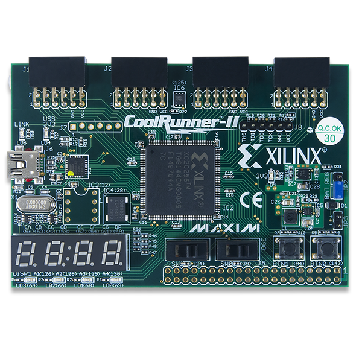
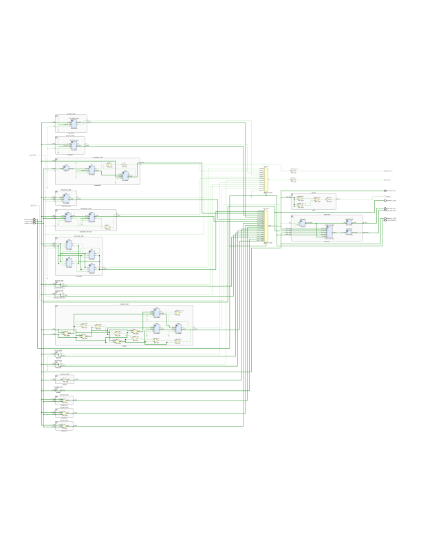

# ALU computing unit

## Popis

4-bitová aritmeticko-logická jednotka se dvěma vstupy A a B a výstupem Y s přenosem C. Jednotka může provádět 16 různých operací (viz tabulka). 

Jednotce lze ručně nastavit vstupní příznak carry, který je u některých operací použit. Výsledná data (včetně vstupů) jsou zobrazena na šestnácti LED diodách a také na čtyřmístném sedmisegmentovém displeji. Všechny vstupní hodnoty se nastavují pomocí přepínačů.

 Vývoj probíhal na vývojové desce CoolRunner-II od firmy Digilent.

CoolRunner-II Starter Board [1]

## Řídící signály ALU

<table>
<tr><td><b>Řídící signál</b></td><td><b>Funkce</b></td><td><b>Popis</b></td></tr>
<tr><td> 0x0 </td><td> Y = A + B </td><td> Součet </td></tr>
<tr><td> 0x1 </td><td> Y = A - B </td><td> Rozdíl </td></tr>
<tr><td> 0x2 </td><td> Y = A + 1 </td><td> Inkrementace </td></tr>
<tr><td> 0x3 </td><td> Y = A - 1 </td><td> Dekrementace </td></tr>
<tr><td> 0x4 </td><td> Y = A + B + C </td><td> Součet s přenosem </td></tr>
<tr><td> 0x5 </td><td> Y = A - B - C </td><td> Rozdíl s přenosem </td></tr>
<tr><td> 0x6 </td><td> Y = A or B </td><td> Logický součet </td></tr>
<tr><td> 0x7 </td><td> Y = A and B </td><td> Logický součin </td></tr>
<tr><td> 0x8 </td><td> Y = A xor B </td><td> Exkluzivní logický součet </td></tr>
<tr><td> 0x9 </td><td> Y = not A </td><td> Logická negace </td></tr>
<tr><td> 0xA </td><td> Y = A &gt;&gt; 1 </td><td> Rotace vpravo </td></tr>
<tr><td> 0xB </td><td> Y = A &lt;&lt; 1 </td><td> Rotace vlevo </td></tr>
<tr><td> 0xC </td><td> Y = (A + C) &gt;&gt; 1 </td><td> Rotace vpravo s přenosem </td></tr>
<tr><td> 0xD </td><td> Y = (A - C) &lt;&lt; 1 </td><td> Rotace vlevo s přenosem </td></tr>
<tr><td> 0xE </td><td> Y = A'H &lt;=&gt; A'L  </td><td> Přehození nejvyššího a nejnižšího čtvrbytu </td></tr>
<tr><td> 0xF </td><td> Y = A mul B </td><td> Součin </td></tr>
</table>

## Funkční bloky

<table><tr>
<td>Sčítačka</td>
<td></td>
<td>Numericky sečte hodnoty na vstupech A, B a výsledek uloží do Y. Příznak přenosu je uložen do C. Vstupní příznak přenosu C je ignorován.</td>

</tr><tr>
<td>Odčítačka</td>
<td></td>
<td>Numericky odečte hodnotu na vstupu B od vstupu A a výsledek uloží do Y. Příznak přenosu je uložen do C. Vstupní příznak přenosu C je ignorován.</td>

</tr><tr>
<td>Inkrementace</td>
<td></td>
<td>Numericky inkrementuje hodnotu na vstupu A o jedničku. Příznak přenosu je uložen do C. Vstupní příznak přenosu C je ignorován.</td>

</tr><tr>
<td>Dekrementace</td>
<td></td>
<td>Numericky dekrementuje hodnotu na vstupu A o jedničku. Příznak přenosu je uložen do C. Vstupní příznak přenosu C je ignorován.</td>

</tr><tr>
<td>Sčítačka s přenosem</td>
<td></td>
<td>Numericky sečte hodnoty na vstupech A, B a výsledek uloží do Y. Příznak přenosu je uložen do C. Vstupní příznak přenosu C je přičten k výsledku Y.</td>

</tr><tr>
<td>Odčítačka s přenosem</td>
<td></td>
<td>Numericky odečte hodnotu na vstupu B od vstupu A a výsledek uloží do Y. Příznak přenosu je uložen do C. Vstupní příznak přenosu C je odečten od výsledku Y.</td>

</tr><tr>
<td>Logický součet</td> 
<td></td>
<td>Provede logický součet hodnot na vstupu A a B. Výsledek uloží do Y.</td>

</tr><tr>
<td>Logický součin</td> 
<td></td>
<td>Provede logický součin hodnot na vstupu A a B. Výsledek uloží do Y</td>

</tr><tr>
<td>Exkluzivní logický součet</td>
<td></td>
<td>Provede logický exkluzivní součet hodnot na vstupu A a B. Výsledek uloží do Y.</td>

</tr><tr>
<td>Logická negace</td>
<td></td>
<td>Provede logickou negaci hodnoty na vstupu A. Výsledek uloží do Y.</td>

</tr><tr>
<td>Rotace vpravo</td>
<td></td>
<td>Provede rotaci hodnoty na vstupu A o jeden bit vpravo. Výsledek uloží do Y. Nejnižší bit je uložen do C. Vstupní příznak C je ignorován.</td>

</tr><tr>
<td>Rotace vlevo</td>
<td></td>
<td>Provede rotaci hodnoty na vstupu A o jeden bit vlevo. Výsledek uloží do Y. Nejvyšší bit je uložen do C. Vstupní příznak C je ignorován.</td>

</tr><tr>
<td>Rotace vpravo s přenosem</td>
<td></td>
<td>Provede rotaci hodnoty na vstupu A o jeden bit vpravo. Výsledek uloží do Y. Nejnižší bit je uložen do C. Vstupní příznak C je uložen na nejvyšší pozici.</td>

</tr><tr>
<td>Rotace vlevo s přenosem</td>
<td></td>
<td>Provede rotaci hodnoty na vstupu A o jeden bit vlevo. Výsledek uloží do Y.
Nejvyšší bit je uložen do C. Vstupní příznak C je uložen na nejnižší pozici.</td>

</tr><tr>
<td>Přehození bitů</td>
<td></td>
<td>Provede vzájemné přehození bitů na vstupu A. Výsledek uloží do Y. Shodné s rotací  vpravo nebo vlevo o dva bity.</td>

</tr><tr>
<td>Násobička</td>
<td></td>
<td>Numericky vynásobí hodnotu na vstupu A s hodnotou na vstupu B. Výsledek uloží do Y. Příznak C signalizuje, že výsledek obsahuje numerickou hodnotu vyšší než 15. Na výstup Y jsou přivedeny vždy 4 nejnižší bity.</td>

</tr><tr>
<td>Parita výsledku</td>
<td></td>
<td>Signalizuje lichý počet jedniček ve výsledku.</td>

</tr><tr>
<td>Jednotka ovládání displeje</td>
<td></td>
<td>Řídí čtyřmístný sedmi-segmentový displej se společnou anodou. Segmenty displeje jsou aktivní v nule. Frekvence signálu clk musí být nejméně 10 kHz.</td>

</tr><tr>
<td>Výsledná ALU jednotka</td>
<td></td>
<td>Celkové vstupy a výstupy jednotky. 
Vstupy number_a a number_b slouží k nastavení čísel se kterými se budou provádět operace. Vstupem control_sig se nastavuje operace, kterou chceme provádět. Hodnoty se nastavují pomocí přepínačů. 
Výstupy number_a, number_b, control_sig a alu_result slouží k binární reprezentaci hodnot, použity jsou LED diody.  
Výstupy disp_digit a disp_sseg slouží k dekadickému zobrazení hodnot na 7segmentovém displeji.  
</td>
</tr></table>

## RTL schéma jednotky
<table>
<tr><td>Celkové zjednodušené</td><td>Více podrobné</td>
</tr><tr>
<td></td>
<td></td>
</tr></table>

### Zdroje
1. https://reference.digilentinc.com/_media/reference/programmable-logic/coolrunner-ii/cr2-2.png